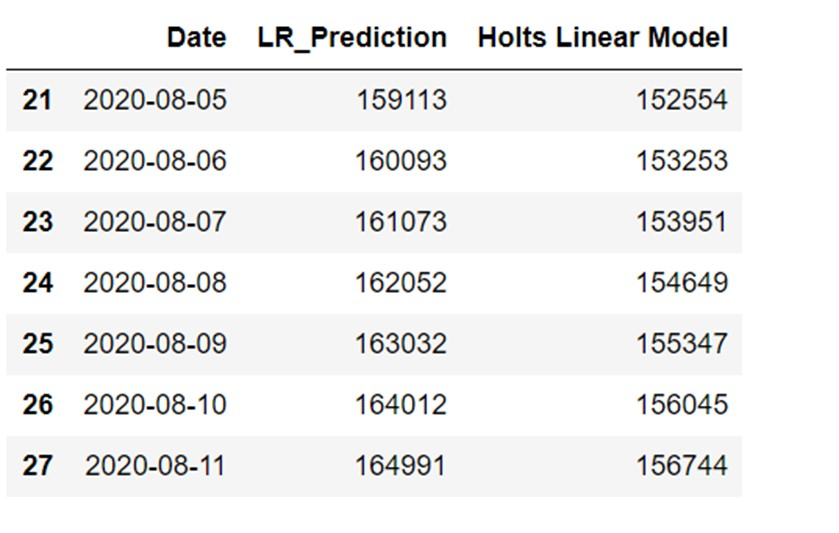

# Covid_19_Death_Prediction
# Summary:
According to the CDC, Coronavirus (Covid_19) is an illness caused by a virus that can spread from person to person. The virus that causes COVID-19 is a new coronavirus that has spread throughout the world. Its symptoms can range from mild to severe illness. Coronavirus disease (COVID-19) is an inflammation disease from a new virus. Basically, it affects the respiratory system of the human, and its known symptoms are fever, common cold, and cough. But it could cause severe damage to the respiratory system and breathing problems. 

1)	Exploratory Data Analysis:

    1)	Checking the types of data:
    2)	Dropping irrelevant columns:
    3)	Renaming the columns:
    4)	Dropping the duplicate rows:
    5)	Dropping the missing or null values:
    6)	Detecting outliers:
    
2)	Data visualization:
3)	Identifying the relationships between variables:
4)	Hypothesis testing:
# Methodology:
1) Linear Regression
2) Holt forecasting 

# Built With:
1) Anaconda Environment
2) Jupyter Notebook
3) Python libraries

